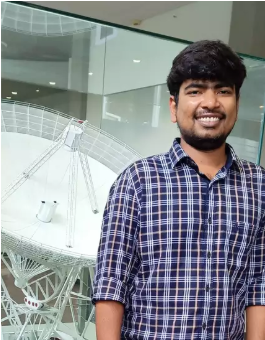

# About Me

I am Sarwar Khan, currently a doctoral student at the Max-Planck-Institut für Radioastronomie, Bonn, Germany in Research Department Millimeter and Submillimeter Astronomy. I did my graduation from National Institute of Technology, Agartala, Tripura, India in B.Sc. in Physics. After that I pursued my M.Sc. from Indian Institute of Space Science and Technology, Thiruvananthapuram, Kerala, India in Earth and Space Science.
